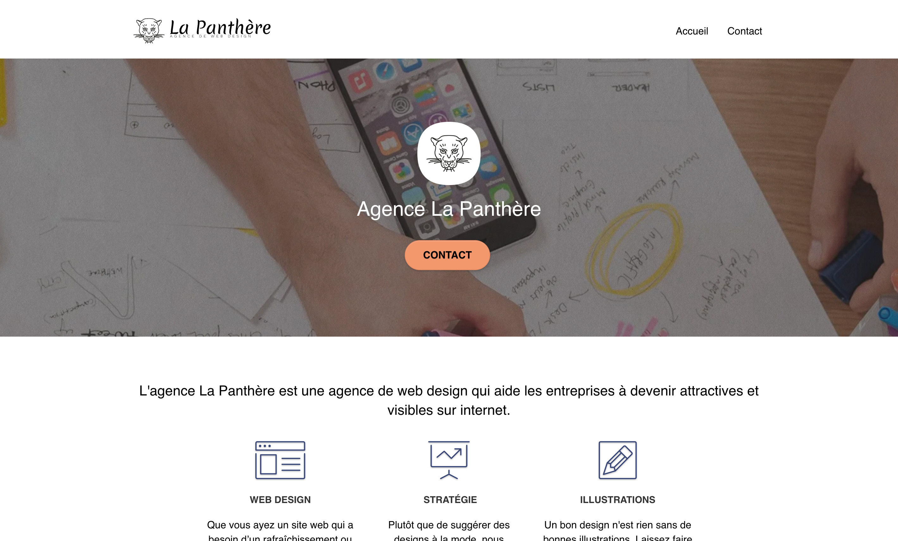

ℹ️ <b>Un README plus complet arrive bientôt ...</b>

# 

Projet réalisé dans le cadre de la formation Développeur Web avec OpenClassrooms

## 🧐 Contexte (fictif)
Vous travaillez pour l'agence La Panthère, une grande agence de web design basée à Lyon. L’activité de l’entreprise a bien démarré mais aujourd’hui, elle est en perte de vitesse. Eh oui, la concurrence est rude. La fondatrice de l’entreprise, Sophie, cherche une solution pour faire repartir l’activité. En tapant “Entreprise web design Lyon” sur Internet, elle s’aperçoit que le site de l’agence apparaît seulement en deuxième page des moteurs de recherche. Par chance, un de vos collègues, Martin, lui a dit que vous étiez un spécialiste en référencement.

## 🚀 Objectifs
1. Analyse de l’état actuel de SEO du site fourni.
2. Amélioration du SEO du site.
3. Comparaison des résultats.

## 🛠️ Technologies

## 🏆 Résultat

➡️  [Visiter le site](https://halaiks.github.io/OC-P4-Agence-La-Panthere/)

## 🙋🏼‍♂️ Auteur

#### Alexandre GUILLAUME

- Site web : [Alexandre-Guillaume.fr](https://alexandre-guillaume.fr)
- Github : [@Halaiks](https://github.com/Halaiks)
